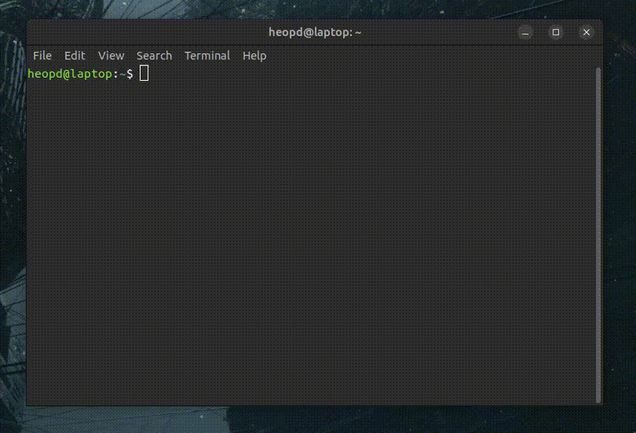

bandcamp-player-evo
============

streaming random music from bandcamp by specified genre subgenre inspired on https://github.com/strizhechenko/bandcamp-player

Usage
=====

``bandcamp-player-evo ["genre"] ["sub genre"]``

Genres can be found on the bandcamp homepage. Slashes spaces and &'s in the genre name should be replaced by dashes (hip-hop/rap becomes hip-hop-rap r&b/soul becomes r-b-soul, field recordings becomes field-recordings). If a certain genre subgenre combo does not work, bandcamp-fetch gets you a random album from the "all" category. You can enter "" as the second argument in order to play from all subgenres of that genre. This equates to "all-genre"

MPV

check https://mpv.io/manual/master/ for keyboard controls of the mpv cli music player (eg arrows to scrub, ">" to go to next track)

Installation
============
install node and npm https://nodejs.org/en/download/, tutorial (https://radixweb.com/blog/installing-npm-and-nodejs-on-windows-and-mac)

install python version 3.4 or above+

install mpv (https://mpv.io/installation/)

install bandcamp-fetch (https://github.com/patrickkfkan/bandcamp-fetch ) with

``npm i bandcamp-fetch --save``

Test it by running ``node ~/bandcamp-player-evo/bandcamp_parser/scrape.js "ambient" "drone"`` if no error is given and the albums.json file in ``/bandcamp_parser`` has in it's results the correct ambient and drone ``params``, you're good to go.

make sure you are in the folder you downloaded from github

``cd bandcamp-player-evo``

install the package

``pip install -e .``

Description
===========

bandcamp-player is a small command-line app to stream audio from BandCamp.com. It requires the Python interpreter, version 3.4+.

You also need mpv installed.

You also need node installed (for scrape.js)

You also need https://github.com/patrickkfkan/bandcamp-fetch (for scrape.js)

Bugs
====

Bugs should be reported in the issues section
