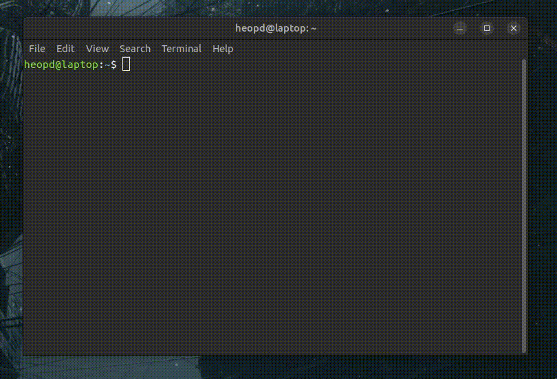

bandcamp-player-evo
============

streaming random music from bandcamp by specified genre subgenre inspired on https://github.com/strizhechenko/bandcamp-player

Usage
=====

``bandcamp-player-evo ["genre"] ["sub genre"]``

Genres can be found on the Bandcamp homepage. Slashes spaces and &'s in the genre name should be replaced by dashes (hip-hop/rap becomes hip-hop-rap r&b/soul becomes r-b-soul, field recordings becomes field-recordings). If a certain genre subgenre combo does not work, the player retries with just the genre and then falls back to a random album from the "all" category. You can enter "" as the second argument in order to play from all subgenres of that genre.

MPV

check https://mpv.io/manual/master/ for keyboard controls of the mpv cli music player (eg arrows to scrub, ">" to go to next track)

Installation
============
install `uv` https://docs.astral.sh/uv/

install mpv (https://mpv.io/installation/)

``cd`` into the ``bandcamp-player-evo`` folder

assuming you have cloned ``bandcamp-player-evo`` in your home folder:

set up the project environment with

``uv sync``

Test it by running ``uv run python -m unittest discover -s tests``.

make sure again you are in the folder you downloaded from github

from your home folder: 

``cd bandcamp-player-evo``

run the CLI with

``uv run bandcamp-player-evo ambient drone``

Try With `uvx`
==============

from the repo folder, you can try the packaged CLI without installing it globally:

``uvx --from . bandcamp-player-evo ambient drone``

from another machine, point `uvx` at the git repo:

``uvx --from git+https://github.com/hopdebee/bandcamp-player-evo.git bandcamp-player-evo ambient drone``

this requires `uv` and `mpv` to be installed on the target machine.

Description
===========

bandcamp-player is a small command-line app to stream audio from BandCamp.com. It requires the Python interpreter, version 3.6+.

You also need mpv installed.

Bugs
====

Bugs should be reported in the issues section
